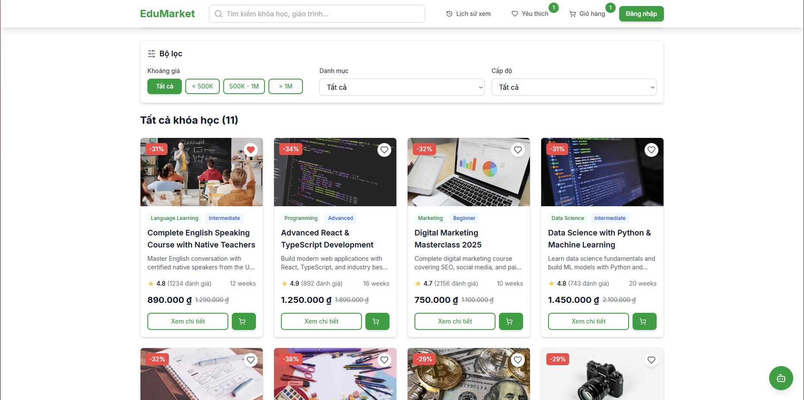
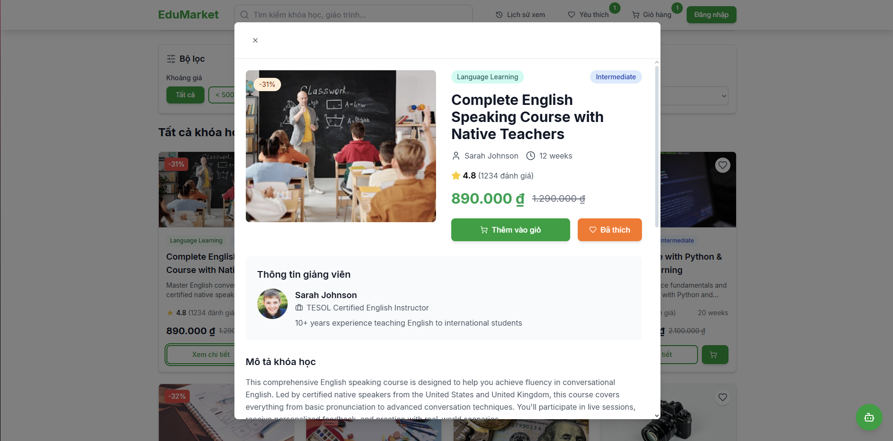
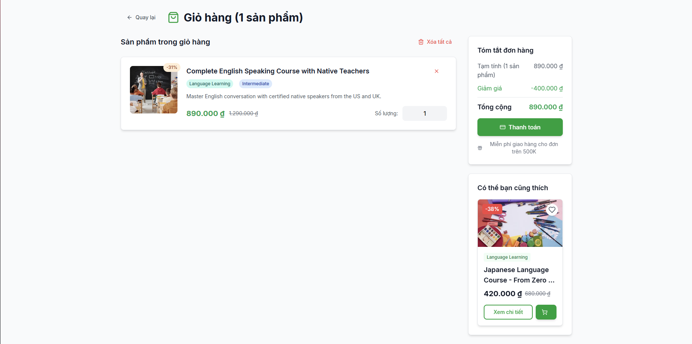

# 🎓 Nền tảng Học tập Trực tuyến EduMarket

Một nền tảng học tập trực tuyến toàn diện được xây dựng bằng React, TypeScript và các công nghệ web hiện đại. Hệ thống cung cấp trải nghiệm mua sắm và học tập trực tuyến với nhiều tính năng tiện ích.

# Screenshots
- HomePage

- Product

- Detail Product

- Cart 



## ✨ Tính năng Chính

### 🔐 Xác thực & Bảo mật
- **Đăng nhập/Đăng ký**: Hệ thống xác thực người dùng an toàn
- **Quản lý Token**: Sử dụng JWT để bảo mật thông tin
- **Lưu trữ Local**: Duy trì trạng thái đăng nhập và giỏ hàng

### 📚 Quản lý Khóa học
- **Tìm kiếm & Lọc**: Tìm kiếm khóa học với nhiều tiêu chí
- **Danh mục**: Phân loại khóa học theo chủ đề
- **Đánh giá**: Hệ thống đánh giá và nhận xét từ học viên
- **Giảng viên**: Thông tin chi tiết về giảng viên

### 🛒 Giỏ hàng & Yêu thích
- **Giỏ hàng**: Thêm/xóa khóa học, tính tổng tiền
- **Danh sách yêu thích**: Lưu trữ các khóa học quan tâm
- **Lịch sử xem**: Theo dõi các khóa học đã xem

### 🤖 Trợ lý AI
- **Chatbot tư vấn**: Hỗ trợ tìm kiếm khóa học phù hợp
- **Gợi ý cá nhân hóa**: Đề xuất khóa học dựa trên sở thích


## 🛠️ Công nghệ sử dụng

### Frontend
- **React + TypeScript**: Phát triển UI với type-safe
- **Vite**: Công cụ build hiện đại và nhanh chóng
- **React Router**: Điều hướng trong ứng dụng

### UI & Styling
- **Tailwind CSS**: Framework CSS tiện lợi
- **Lucide Icons**: Thư viện icon đẹp và nhẹ
- **Custom Components**: Các component UI tái sử dụng

### Quản lý State & API
- **Context API**: Quản lý state toàn cục
- **Local Storage**: Lưu trữ dữ liệu cục bộ

## 🚀 Hướng dẫn cài đặt

1. **Clone dự án**
   ```bash
   git clone <repository-url>
   cd E-commerce_Education_FE
   ```

2. **Cài đặt dependencies**
   ```bash
   npm install
   ```

3. **Khởi chạy môi trường development**
   ```bash
   npm run dev
   ```

## 📱 Cấu trúc ứng dụng

### Trang chính
- **Trang chủ**: Hiển thị khóa học nổi bật và danh mục
- **Chi tiết khóa học**: Thông tin chi tiết và đánh giá
- **Giỏ hàng**: Quản lý khóa học đã chọn
- **Yêu thích**: Danh sách khóa học yêu thích

### Components chính
- **Header**: Điều hướng và tìm kiếm
- **Filterbar**: Lọc khóa học theo tiêu chí
- **ProductCard**: Hiển thị thông tin khóa học
- **Chatbot**: Trợ lý AI tư vấn

## 👥 Phát triển bởi
- **Developer**: **Nguyen Tan Loc**
- **Project**: E-commerce Education Platform
- **Stack**: React + TypeScript + Vite
